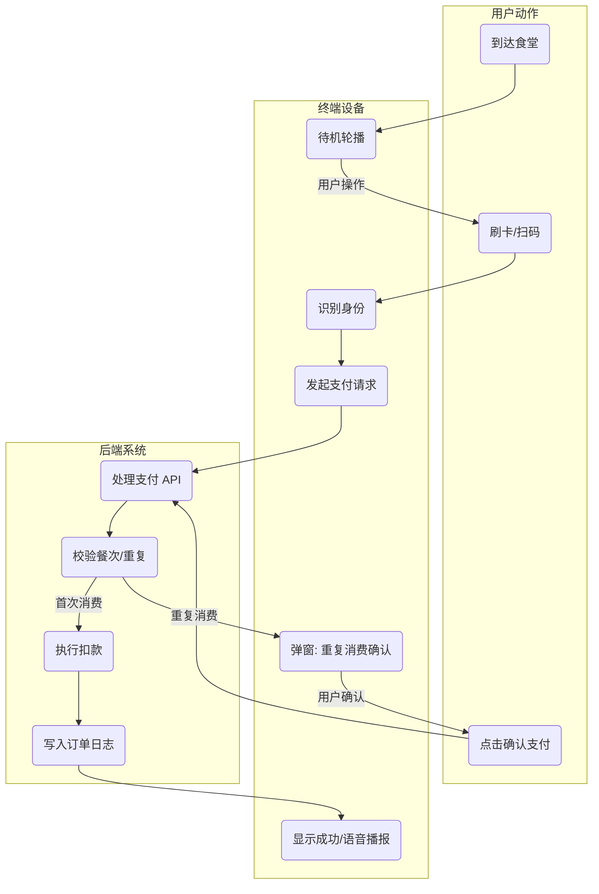

# 业务流程图 (泳道图)

```mermaid
graph TD
    subgraph User [用户动作]
        User_Arrive(到达食堂)
        User_Action(刷卡/扫码)
        User_Confirm(点击确认支付)
    end

    subgraph Terminal [终端设备]
        Term_Idle(待机轮播)
        Term_Identify(识别身份)
        Term_Request(发起支付请求)
        Term_Popup(弹窗: 重复消费确认)
        Term_Success(显示成功/语音播报)
    end

    subgraph Backend [后端系统]
        API_Pay(处理支付 API)
        Logic_Check(校验餐次/重复)
        Logic_Deduct(执行扣款)
        DB_Log(写入订单日志)
    end

    User_Arrive --> Term_Idle
    Term_Idle -->|用户操作| User_Action
    User_Action --> Term_Identify
    Term_Identify --> Term_Request
    
    Term_Request --> API_Pay
    API_Pay --> Logic_Check
    
    Logic_Check -->|首次消费| Logic_Deduct
    Logic_Check -->|重复消费| Term_Popup
    
    Term_Popup -->|用户确认| User_Confirm
    User_Confirm --> API_Pay
    
    Logic_Deduct --> DB_Log
    DB_Log --> Term_Success
```
