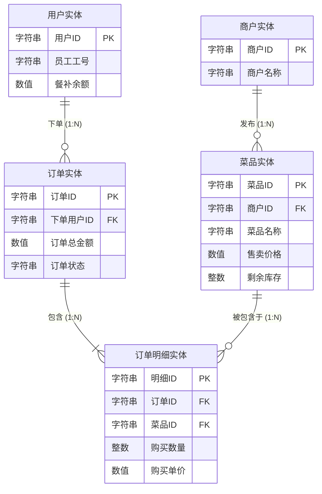
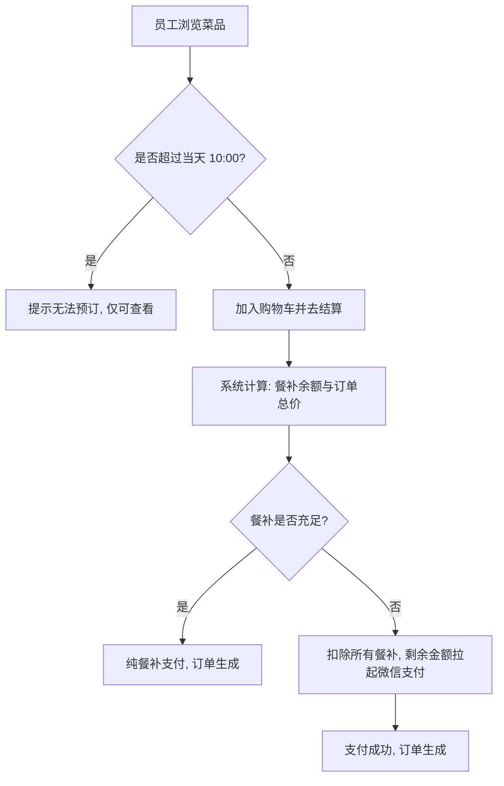
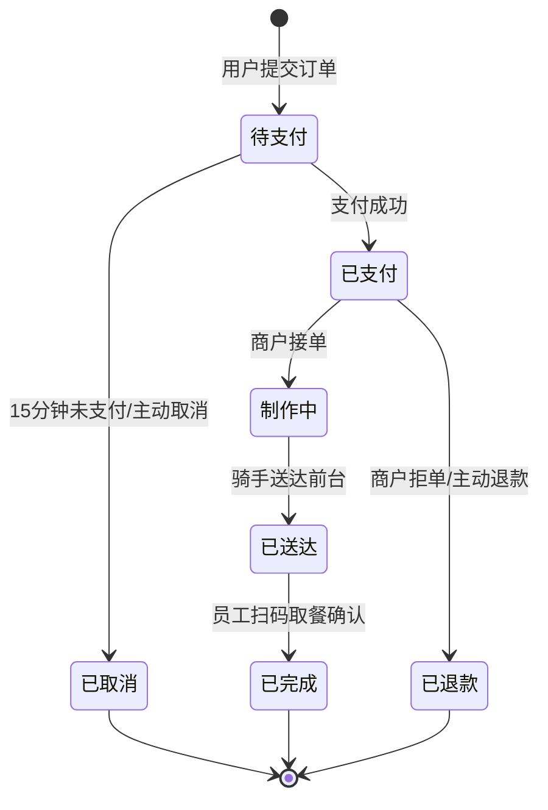
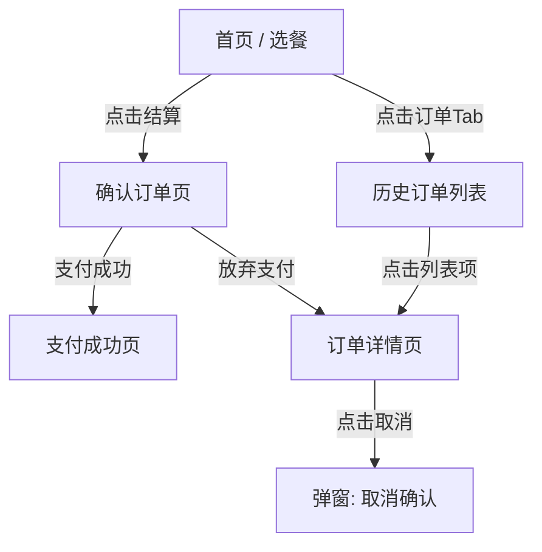

# 产品需求文档 (PRD) - 标准结构示例 (以“企业外卖点餐系统”为例)

> **文档说明**：
> 这是一个用于展示“最规范 PRD 结构”的示例文档。文档不依赖于任何真实项目，而是虚构了一个“企业外卖点餐系统（FoodieCorp）”作为背景，旨在展示如何通过结构化、表格化和去二义性的方式，清晰地向开发人员和 AI 传达业务逻辑、数据关系和页面细节。

***

## 1. 文档信息 (Document Information)

### 1.1 修订记录

| 版本号  | 变更日期       | 变更内容                                                    | 变更人  |
| :--- | :--------- | :------------------------------------------------------ | :--- |
| v1.0 | 2026-10-01 | 初始版本创建。                                                 | 产品经理 |
| v1.1 | 2026-10-02 | 根据最新规范重构：调整一级目录结构、补充用户画像与旅程、完善ER图与状态机图、重构功能模块的“总分”讲解结构。 | 产品经理 |

### 1.2 关联文档链接

- [高保真 UI 原型 (Figma)](#)
- [技术架构评审记录](#)

***

## 2. 背景 (Background)

### 2.1 项目概述与目标

“FoodieCorp” 是一款专为中大型企业员工提供的内部点餐小程序。
**核心目标**：

1. 解决员工午餐就餐拥挤问题，支持提前一天预订。
2. 接入企业 OA 系统的餐补账户，实现“餐补扣减 + 个人微信补差价”的混合支付。
3. 聚合周边白名单商户，统一集中配送至公司前台。

### 2.2 用户画像 (User Personas)

| 角色名称              | 核心特征              | 核心痛点                      | 核心诉求                        |
| :---------------- | :---------------- | :------------------------ | :-------------------------- |
| **普通员工 (C端)**     | 每天在公司吃午饭的白领，时间紧凑。 | 午休时间短，下楼排队买饭太耗时；餐补不用会清零。  | 能提前看菜单并预订；能直接用掉餐补，不够的再自己掏钱。 |
| **入驻商户 (B端)**     | 公司园区周边的餐饮店老板。     | 线下高峰期接待能力有限，希望拓展稳定的大客户订单。 | 能提前一天拿到汇总订单方便备餐；资金结算清晰。     |
| **平台管理员 (Admin)** | 公司行政或后勤人员。        | 每个月核对餐补报销极其繁琐。            | 系统自动扣减餐补；对商户进行白名单管理和统一结算。   |

### 2.3 用户故事 (User Stories)

**作为** 一名普通员工，
**我希望** 能够在每天早上10点前，浏览当天的可选菜品并下单，
**以便于** 我能在中午12点准时在前台拿到午餐，节省排队时间。
**验收标准**：

- 必须在 10:00 前允许下单。
- 支付时优先扣除我的餐补余额。

### 2.4 用户旅程 (User Journey)

| 阶段       | 1. 浏览与选择              | 2. 下单与支付                  | 3. 履约与取餐           | 4. 售后与评价       |
| :------- | :-------------------- | :------------------------ | :----------------- | :------------- |
| **用户行为** | 打开小程序，查看今日推荐菜品，加入购物车。 | 确认订单，系统扣减餐补，差额唤起微信支付完成付款。 | 收到送达通知，前往公司前台扫码取餐。 | 在历史订单中对菜品进行打分。 |
| **接触触点** | 首页列表、购物车组件            | 确认订单页、支付弹窗                | 订单详情页、微信模板消息       | 评价弹窗           |

***

## 3. 名词字典与实体关系 (Data & ER Model)

### 3.1 业务概念

| 业务名词     | 业务含义与约束                                 |
| :------- | :-------------------------------------- |
| **截单时间** | 每日允许员工下单的最后期限（默认 10:00 AM）。超过此时只能看，不能买。 |
| **企业餐补** | 公司每月发放给员工的虚拟货币，1餐补 = 1元人民币，不可提现。        |
| **混合支付** | 当订单金额 > 餐补余额时，优先扣空餐补，差额使用第三方支付。         |

### 3.2 名词字典与实体属性 (Entities)

#### 3.2.1 菜品实体

| 字段名称    | 字段类型 | 限制/长度     | 必填 | 业务含义                       |
| :------ | :--- | :-------- | :- | :------------------------- |
| `菜品ID`  | 字符串  | 32字符      | 是  | 菜品的唯一标识。                   |
| `商户ID`  | 字符串  | 32字符      | 是  | 关联的商户ID。                   |
| `菜品名称`  | 字符串  | 最长20字符    | 是  | 菜品名称（如“辣椒炒肉”）。             |
| `售卖价格`  | 数值   | 两位小数      | 是  | 售卖价格。                      |
| `剩余库存`  | 整数   | >= 0      | 是  | 每日限量库存。                    |
| `上下架状态` | 枚举   | `下架`,`上架` | 是  | 上下架状态（`上架`: 可售; `下架`: 禁售）。 |

#### 3.2.2 订单实体

| 字段名称     | 字段类型 | 限制/长度 | 必填 | 业务含义                 |
| :------- | :--- | :---- | :- | :------------------- |
| `订单ID`   | 字符串  | 32字符  | 是  | 订单的唯一标识。             |
| `下单用户ID` | 字符串  | 32字符  | 是  | 下单员工的唯一标识。           |
| `订单总金额`  | 数值   | 两位小数  | 是  | 订单商品总金额。             |
| `餐补支付金额` | 数值   | 两位小数  | 是  | 订单中由“企业餐补”支付的金额。     |
| `现金支付金额` | 数值   | 两位小数  | 是  | 订单中由微信/支付宝实际支付的现金金额。 |
| `订单状态`   | 枚举   | 详见状态机 | 是  | 当前订单所处的生命周期阶段。       |

### 3.3 实体关系图 (ER Diagram)

***

## 4. 流程结构 (Flow Structure)

### 4.1 主流程及分支流程

### 4.2 核心状态机 (`订单状态`)

### 4.3 页面信息结构与跳转

***

## 5. 全局规则 (Global Rules)

*注：本章节定义跨越所有页面的底层共性规则，特定页面的展示与交互规则请见第 6 节。*

### 5.1 金额与数字展示规范

- 所有涉及金额的字段（原价、实付、餐补），前端展示时必须强制保留两位小数，并带上货币符号（如：`￥15.00`）。
- 千分位：金额大于 1000 时，必须使用逗号分隔（如：`￥1,200.50`）。

### 5.2 全局异常与容错策略

- **接口防抖/幂等**：所有涉及写操作（如下单、支付、取消）的按钮，点击后必须立即变为 `Loading` 状态，防止连点重复提交。后端需基于 `Request-ID` 做好接口幂等性校验。
- **断网兜底**：全局拦截网络请求错误。若超时（>8s）或无网络，统一在页面顶部弹出红色警告 Toast：“网络开小差了，请检查网络设置后重试”。

***

## 6. 功能模块与页面细节 (Functional Specs)

### 6.1 首页选餐模块 (`home/index`)

#### 6.1.1 页面整体说明

- **页面概述**：员工登录后的默认落地页，展示当前可用菜品，并提供加入购物车功能。准入前置条件为：用户已通过企业微信静默登录。
- **页面结构与状态矩阵**：

| 页面状态      | 包含区域/弹窗                    | 状态触发条件                      |
| :-------- | :------------------------- | :-------------------------- |
| **常规选餐态** | 顶部公告区、餐补资产区、菜品列表区、底部购物车悬浮栏 | 当前时间在当日 00:00 - 10:00 之间。   |
| **截单禁售态** | 顶部公告区(警告样式)、餐补资产区、菜品列表区    | 当前时间已超过当日 10:00。隐藏底部购物车悬浮栏。 |
| **弹窗**    | 清空购物车确认弹窗                  | 用户点击购物车内的垃圾桶图标。             |

- **页面全局异常**：若获取用户餐补余额接口失败，餐补区域展示为 `￥--`，并在该区域提供“点击重试”按钮，不阻塞下方菜品列表的浏览。

***

#### 6.1.2 菜品列表区

- **区域介绍与规则**：采用触底无限滚动加载（Infinite Scroll）。单页请求 15 条数据，距底部距离 200px 时触发加载下一页。优先按“历史销量”降序，其次按“创建时间”降序。
- **展示元素定义**：

| 元素名称 | 逻辑 (数据来源/计算逻辑) | 限制与格式                              |
| :--- | :------------- | :--------------------------------- |
| 菜品图片 | `菜品实体.图片URL`   | 采用 1:1 比例正方形裁切，加载失败时展示默认占位图。       |
| 菜品名称 | `菜品实体.菜品名称`    | 最多显示单行，超出部分用 `...` 截断。             |
| 售卖价格 | `菜品实体.售卖价格`    | 红色加粗字体，格式 `￥{价格}`。                 |
| 剩余库存 | `菜品实体.剩余库存`    | 当库存 <= 5 时，标红显示“仅剩X份”；否则显示为灰色正常字体。 |

- **区域交互**：
  - **前置条件**：当前页面处于“常规选餐态”，且该菜品 `剩余库存 > 0`。
  - **触发动作**：点击菜品卡片右下角的【+】按钮。
  - **结果呈现**：底部购物车图标出现抛物线飞入动画；购物车角标数字 `+1`；本地更新购物车状态。
- **异常与兜底**：
  - 若点击瞬间，后端校验该菜品已无库存，则阻断加入购物车，弹出 Toast 提示：“手慢了，该菜品刚刚售罄”，并将该卡片置灰。

***

#### 6.1.3 底部购物车悬浮栏

- **区域介绍与规则**：固定悬浮在页面底部，实时汇总当前选中的菜品总价。当购物车为空时，按钮置灰不可点击。
- **展示元素定义**：

| 元素名称  | 逻辑 (数据来源/计算逻辑)    | 限制与格式                              |
| :---- | :---------------- | :--------------------------------- |
| 购物车图标 | 本地购物车数组 `长度`      | 图标右上角带红色气泡角标显示总件数。若件数>99，显示 `99+`。 |
| 合计金额  | `总计(选中菜品单价 * 数量)` | 格式 `￥{合计}`。                        |
| 结算按钮  | 固定文案“去结算”         | 若合计金额为0，背景色为灰色；否则为高亮品牌色。           |

- **区域交互**：
  - **前置条件**：购物车内至少有一件商品。
  - **触发动作**：点击【去结算】按钮。
  - **结果呈现**：页面跳转至“确认订单页”，并将购物车数据作为入参传递。

***

### 6.2 确认订单页

#### 6.2.1 页面整体说明

- **页面概述**：用户确认购买明细，系统自动计算并展示餐补与现金的混合支付情况，发起支付的核心页面。准入条件：必须携带有效的选中商品数据进入。
- **页面结构与状态矩阵**：

| 页面状态       | 包含区域/弹窗               | 状态触发条件             |
| :--------- | :-------------------- | :----------------- |
| **纯餐补支付态** | 商品明细区、支付资产计算区、底部支付操作栏 | 订单总价 <= 当前用户的餐补余额。 |
| **混合支付态**  | 商品明细区、支付资产计算区、底部支付操作栏 | 订单总价 > 当前用户的餐补余额。  |

- **页面全局异常**：进入页面时，系统会进行一次全局库存预校验，若有商品已售罄，直接弹出全屏模态框提示：“部分商品已失效”，并强制用户返回上一页重新选择。

***

#### 6.2.2 支付资产计算区

- **区域介绍与规则**：展示订单费用的组成逻辑，让用户清楚地知道餐补抵扣了多少，自己还需要掏多少钱。
- **展示元素定义**：

| 元素名称 | 逻辑 (数据来源/计算逻辑)              | 限制与格式                                  |
| :--- | :-------------------------- | :------------------------------------- |
| 订单总价 | 遍历商品明细的累加值                  | 黑色常规字体，格式 `￥{金额}`。                     |
| 餐补抵扣 | `取最小值(订单总价, 用户实体.餐补余额)`     | 红色字体，前缀带减号（如：`-￥15.00`）。若抵扣额为0，则整行不显示。 |
| 还需支付 | `取最大值(0, 订单总价 - 用户实体.餐补余额)` | 黑色加粗字体，格式 `￥{金额}`。                     |

- **区域交互**：纯展示区域，无用户触发的直接交互。

***

#### 6.2.3 底部支付操作栏

- **区域介绍与规则**：悬浮在页面底部，执行最终的创单与支付动作。
- **展示元素定义**：

| 元素名称  | 逻辑 (数据来源/计算逻辑)                   | 限制与格式       |
| :---- | :------------------------------- | :---------- |
| 待支付金额 | 同上方的“还需支付”逻辑                     | 大号红色字体。     |
| 支付按钮  | 若还需支付=0，文案为“确认下单”；若>0，文案为“微信支付”。 | 点击后变为加载中状态。 |

- **区域交互**：
  - **前置条件**：页面无报错，商品库存充足。
  - **触发动作**：点击支付按钮。
  - **结果呈现**：
    1. 调用后端创单接口，生成 `订单状态=待支付` 的订单记录。
    2. 若为混合支付态：唤起微信小程序原生支付收银台。支付成功后跳转“支付成功页”。
    3. 若为纯餐补支付态：直接扣减后端餐补资产，订单状态变更为 `已支付`，跳转“支付成功页”。
- **异常与兜底**：
  - **用户中途取消微信支付**：收银台关闭，当前页面重定向至“订单详情页”，该订单处于 `待支付` 状态，并开始 15 分钟倒计时。

***

### 6.3 【弹窗】取消订单二次确认

#### 6.3.1 弹窗整体说明

- **页面概述**：依附于“订单详情页”内的一个阻断式模态框，用于防止用户误触导致取消订单的保护机制。
- **弹窗结构**：固定包含 标题区、说明区、操作按钮区。

#### 6.3.2 弹窗交互区域

- **区域介绍与规则**：采用标准的左灰右红的双按钮结构。
- **展示元素定义**：

| 元素名称 | 逻辑 (数据来源/计算逻辑)                             | 限制与格式      |
| :--- | :----------------------------------------- | :--------- |
| 标题文案 | 固定文本：“确认取消订单？”                             | 黑色加粗，居中。   |
| 补充说明 | 判断订单中是否有 `餐补支付金额 > 0`。若有，显示“取消后餐补额度将原路退回”。 | 灰色小字，居中。   |
| 暂不取消 | 固定按钮                                       | 左侧，灰色线框按钮。 |
| 确认取消 | 固定按钮                                       | 右侧，红色实心按钮。 |

- **区域交互**：
  - **前置条件**：用户在订单详情页点击了【取消订单】按钮，且当前订单状态为 `待支付` 或 `已支付`（注：商户接单 `制作中` 后此入口被隐藏）。
  - **触发动作 A**：点击 \[暂不取消] -> **结果**：关闭弹窗，无其他动作。
  - **触发动作 B**：点击 \[确认取消] -> **结果**：调用后端取消接口。成功后关闭弹窗，弹出 Toast 提示“取消成功”，底层订单详情页刷新，状态变更为 `已取消`。
- **异常与兜底**：
  - 若在用户犹豫期间，商户刚好操作了接单（状态变更为 `制作中`），此时点击确认取消，后端将拒绝请求。前端需捕获此错误，弹窗提示：“商户已接单，无法取消”，并刷新页面获取最新状态。

