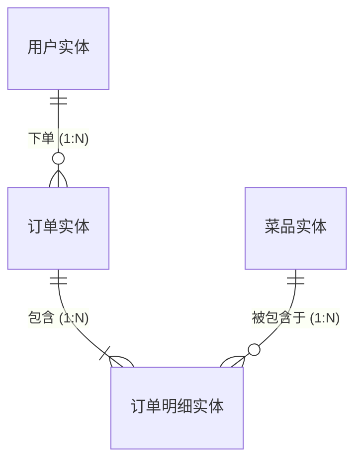
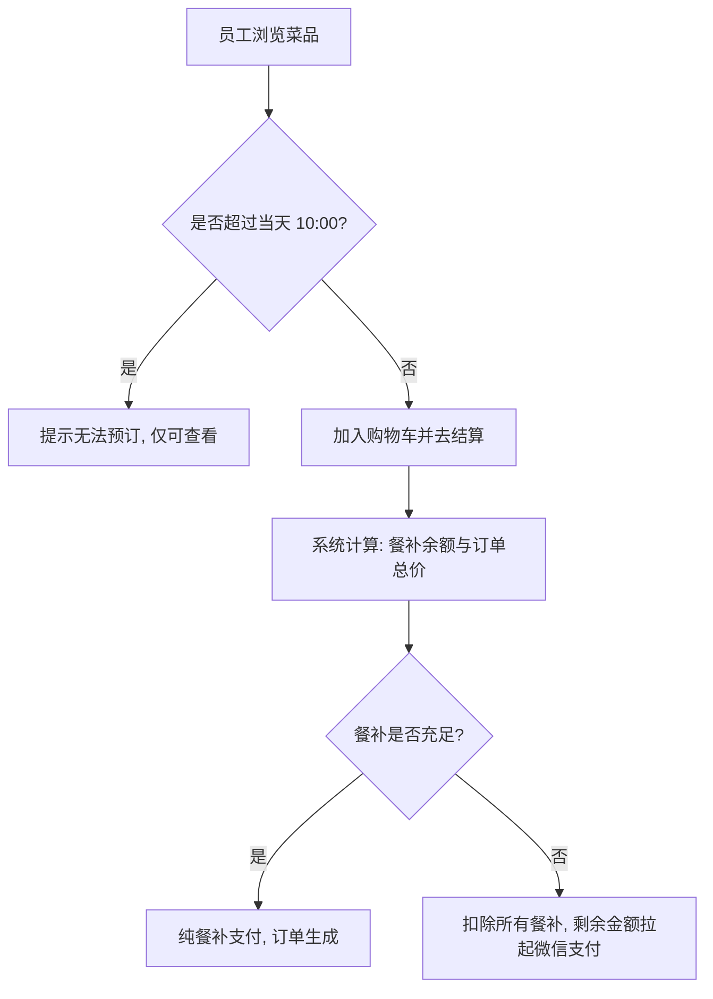
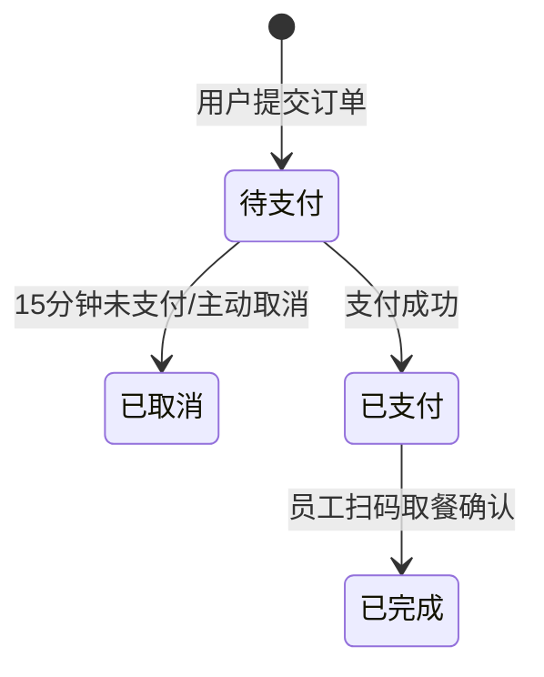

# 产品需求文档 (PRD) - 标准结构示例 (以“企业外卖点餐系统”为例)

> **文档说明**：
> 这是一个用于展示“最规范 PRD 结构”的示例文档。文档不依赖于任何真实项目，旨在展示如何通过结构化、标签化嵌套列表和去二义性的方式，清晰地向开发人员和 AI 传达业务逻辑、数据关系和页面细节。

***

## 1. 文档信息 (Document Information)

### 1.1 修订记录

| 版本号  | 变更日期       | 变更内容                                                    | 变更人  |
| :--- | :--------- | :------------------------------------------------------ | :--- |
| v1.0 | 2026-10-01 | 初始版本创建。                                                 | 产品经理 |
| v1.1 | 2026-10-02 | 根据最新规范重构：调整一级目录结构、重构第6章“总分”讲解结构（引入思维导图与缩进列表）、补充后台机制。 | 产品经理 |

### 1.2 关联文档链接

- [高保真 UI 原型 (Figma)](#)
- [技术架构评审记录](#)

***

## 2. 背景 (Background)

### 2.1 项目概述与目标

“FoodieCorp” 是一款专为中大型企业员工提供的内部点餐小程序。
**核心目标**：
1. 解决员工午餐就餐拥挤问题，支持提前一天预订。
2. 接入企业 OA 系统的餐补账户，实现“餐补扣减 + 个人微信补差价”的混合支付。

### 2.2 用户画像 (User Personas)

| 角色名称              | 核心特征              | 核心诉求                        |
| :---------------- | :---------------- | :-------------------------- |
| **普通员工 (C端)**     | 每天在公司吃午饭的白领，时间紧凑。 | 能提前看菜单并预订；能直接用掉餐补，不够的再自己掏钱。 |

### 2.3 用户故事 (User Stories)

**作为** 一名普通员工，
**我希望** 能够在每天早上10点前，浏览当天的可选菜品并下单，
**以便于** 我能在中午12点准时在前台拿到午餐，节省排队时间。
**验收标准**：
- 必须在 10:00 前允许下单。
- 支付时优先扣除我的餐补余额。

***

## 3. 名词字典与实体关系 (Data & ER Model)

### 3.1 业务概念

| 业务名词     | 业务含义与约束                                 |
| :------- | :-------------------------------------- |
| **截单时间** | 每日允许员工下单的最后期限（默认 10:00 AM）。超过此时只能看，不能买。 |
| **混合支付** | 当订单金额 > 餐补余额时，优先扣空餐补，差额使用第三方支付。         |

### 3.2 名词字典与实体属性 (Entities)

#### 3.2.1 菜品实体
| 字段名称    | 字段类型 | 限制/长度     | 必填 | 业务含义                       |
| :------ | :--- | :-------- | :- | :------------------------- |
| `菜品ID`  | 字符串  | 32字符      | 是  | 菜品的唯一标识。                   |
| `售卖价格`  | 数值   | 两位小数      | 是  | 售卖价格。                      |
| `剩余库存`  | 整数   | >= 0      | 是  | 每日限量库存。                    |

#### 3.2.2 订单实体
| 字段名称     | 字段类型 | 限制/长度 | 必填 | 业务含义                 |
| :------- | :--- | :---- | :- | :------------------- |
| `订单ID`   | 字符串  | 32字符  | 是  | 订单的唯一标识。             |
| `订单总金额`  | 数值   | 两位小数  | 是  | 订单商品总金额。             |
| `订单状态`   | 枚举   | 详见状态机 | 是  | 当前订单所处的生命周期阶段。       |

### 3.3 实体关系图 (ER Diagram)



***

## 4. 流程结构 (Flow Structure)

### 4.1 主流程及分支流程



### 4.2 核心状态机 (`订单状态`)



***

## 5. 全局规则与后台机制 (Global Rules & Backend Mechanisms)

*注：本章节定义跨越所有页面的底层共性规则及“看不见”的暗逻辑。*

### 5.1 金额与数字展示规范
- 所有涉及金额的字段（原价、实付、餐补），前端展示时必须强制保留两位小数，并带上货币符号（如：`￥15.00`）。

### 5.2 全局异常与容错策略
- **接口防抖/幂等**：所有涉及写操作的按钮，点击后必须立即变为 `Loading` 状态，后端需基于 `Request-ID` 做好幂等性校验。

### 5.3 后台运行机制与触发器 (Dark Logic)
- **【定时任务】未支付订单自动取消**：系统每分钟轮询，扫描 `订单状态` 为 `待支付` 且创建时间超过 15 分钟的记录，自动将状态流转为 `已取消`，并释放锁定的菜品库存。
- **【消息推送】餐补到账通知**：每月 1 日凌晨 00:00，系统向所有在职员工发放当月餐补，并发放成功后触发企业微信应用消息推送。

***

## 6. 功能模块与页面细节 (Functional Specs)

### 6.1 首页选餐模块 (`home/index`)

> **【页面概述】**
> 员工登录后的默认落地页，展示当前可用菜品，并提供加入购物车功能。
> 
> 🚨 **【准入前置条件】**：用户已通过企业微信静默登录，否则拦截重定向至鉴权页。
> 
> ⚠️ **【全局异常兜底】**：若获取用户餐补余额接口失败，餐补区域展示为 `￥--`，提供“点击重试”按钮，**绝不阻塞**下方菜品列表的正常浏览与下单。

> **【页面区域与状态树】**
> ```text
> 首页选餐模块 (`home/index`)
> ├── 通用区域
> │   ├── 顶部公告区
> │   ├── 餐补资产区
> │   └── 菜品列表区
> ├── 【常规选餐态 00:00-10:00】
> │   └── 底部购物车悬浮栏
> └── 【截单禁售态 >10:00】
>     └── (无附加区域)
> ```

---

#### 🧩 6.1.1 菜品列表区 (通用区域)

**区域规则**：采用触底无限滚动加载。单页请求 15 条数据，优先按“历史销量”降序。

**包含元素**：
*   **`菜品图片`**
    *   **[前端]** 采用 1:1 比例正方形裁切，加载失败时展示默认占位图。
    *   **[数据]** 关联 [菜品实体](#322-菜品实体) 的 `图片URL`。
*   **`菜品名称`**
    *   **[前端]** 最多显示单行，超出部分用 `...` 截断。
    *   **[数据]** 关联 [菜品实体](#322-菜品实体) 的 `菜品名称`。
*   **`剩余库存`**
    *   **[前端]** 当库存 <= 5 时，红字显示 **“仅剩X份”**；否则灰字。
    *   **[数据]** 关联 [菜品实体](#322-菜品实体) 的 `剩余库存`。

**交互与逻辑**：

*   **交互元素 1：【+】按钮 (加入购物车)**
    *   **触发动作**：用户点击菜品卡片右下角的 **【+】** 按钮。
    *   **前置状态与校验拦截**：
        *   *(数据要求)* 该菜品必须 `剩余库存 > 0`。
        *   *(视觉阻断)* 若库存为 0，该卡片整体置灰，【+】按钮隐藏或变更为 **“已售罄”** 标签。
        *   *(交互阻断)* 若瞬间后端校验无库存（如并发抢购），阻断操作并触发 **强提示 (Modal)**：**“该菜品刚刚售罄，请选择其他菜品”**，点击【我知道了】后关闭，并刷新该卡片状态。
        *   *(数据要求 2)* 当前时间必须未超过 [截单时间](#31-业务概念)。
        *   *(交互阻断 2)* 若已过截单时间，触发 **弱提示 (Toast)**：**“已过截单时间，无法选餐”**。
    *   **执行与响应**：
        *   *(前端)* 底部购物车图标出现抛物线飞入动画；购物车角标数字 `+1`。
        *   *(数据)* 将该 [菜品实体](#322-菜品实体) 写入本地购物车缓存。

**状态穷举 (MECE)**：
*   **正常态**：正常展示菜品列表，可滑动加载。
*   **空数据态**：若当天无任何排期菜品，展示缺省页插画及文案 **“今日暂无供餐”**。
*   **加载/过渡态**：首屏加载时展示 4 个卡片的骨架屏（Skeleton）。
*   **极限/边界态**：当滑动到最后一页时，底部展示 **“我是有底线的”** 且不再触发接口。

---

#### 🧩 6.1.2 底部购物车悬浮栏 (常规选餐态 特有)

**区域规则**：固定悬浮在页面底部，实时汇总当前选中的菜品总价。

**包含元素**：
*   **`购物车图标`**
    *   **[前端]** 图标右上角带红色气泡角标。若件数>99，显示 `99+`。
    *   **[数据]** 计算公式：本地购物车数组的商品件数总和。
*   **`合计金额`**
    *   **[前端]** 格式 `￥{合计}`。
    *   **[数据]** 计算公式：选中菜品单价 * 数量的总计。
*   **`结算按钮`**
    *   **[前端]** 若合计金额为0，背景色置灰；否则为高亮品牌色。文案固定为 **【去结算】**。

**交互与逻辑**：

*   **交互元素 1：【去结算】按钮**
    *   **触发动作**：用户点击 **【去结算】** 按钮。
    *   **前置状态与校验拦截**：
        *   *(数据要求)* 购物车内必须至少有一件商品（合计金额 > 0）。
        *   *(视觉阻断)* 若合计金额为 0，按钮背景色强制置灰。
        *   *(交互阻断)* 若置灰态下被点击，不发起请求，触发 **弱提示 (Toast)**：**“请先选择您想吃的菜品”**。
    *   **执行与响应**：
        *   *(前端)* 页面跳转至“确认订单页”，并将购物车数据作为入参传递。

---

### 6.2 确认订单页

> **【页面概述】**
> 用户确认购买明细，系统自动计算并展示餐补与现金的混合支付情况，发起支付的核心页面。
> 
> 🚨 **【准入前置条件】**：必须携带有效的选中商品数据（`sku_list`）且合计金额 > 0 方可进入，否则强阻断并返回首页。

> **【页面区域与状态树】**
> ```text
> 确认订单页 (`order/confirm`)
> ├── 通用区域
> │   ├── 商品明细区
> │   ├── 支付资产计算区
> │   └── 支付操作栏
> ├── 【混合支付态 (订单总价 > 餐补余额)】
> │   └── (需调用微信原生支付组件)
> └── 【纯餐补支付态 (订单总价 <= 餐补余额)】
>     └── (直接扣减余额，无附加UI)
> ```

---

#### 🧩 6.2.1 支付操作栏 (通用区域)

**包含元素**：
*   **`支付按钮`**
    *   **[前端]** 点击后变为加载中状态（Loading）。
    *   **[数据]** 若 `还需支付 = 0`，文案为 **【确认下单】**；若 `还需支付 > 0`，文案为 **【微信支付】**。

**交互与逻辑**：

*   **交互元素 1：【微信支付】/【确认下单】按钮**
    *   **触发动作**：用户点击底部的支付按钮。
    *   **前置状态与校验拦截**：
        *   *(数据要求)* 订单中的所有商品必须 `剩余库存 >= 购买数量`。
        *   *(视觉阻断)* 无。
        *   *(交互阻断)* 若后端校验某商品库存不足，阻断创单流程，触发 **强提示 (Modal)**：**“部分商品已被抢光，请重新选择”**，并强制用户返回上一页。
    *   **执行与响应 (复杂流程图)**：
        ```mermaid
        graph TD
            Start[点击支付] --> API[调用后端创单接口]
            API --> Generate[生成订单, 状态=待支付]
            Generate --> Check{还需支付金额 > 0?}
            Check -->|是: 混合支付态| WxPay[唤起微信原生收银台]
            WxPay -->|支付成功| Success1[跳转支付成功页]
            WxPay -->|用户取消| Cancel[重定向至订单详情页, 开始15分钟倒计时]
            Check -->|否: 纯餐补态| Direct[后端直接扣减餐补]
            Direct --> Success2[状态变更为'已支付', 跳转支付成功页]
        ```
    *   **联动影响 (Side Effects)**：创单成功后，必须实时扣减对应的 [菜品实体](#322-菜品实体) 剩余库存。若在15分钟内未支付导致订单取消，库存必须回滚。
